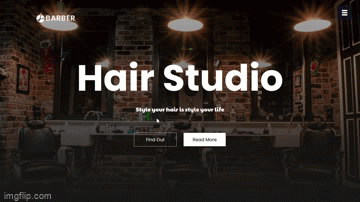

# Barber Shop
The Barber Shop Website is a project I developed using HTML, CSS, and JavaScript. It showcases a modern and interactive website for a barber shop, providing information about services, prices.

**Link to project:** https://ba-beker.github.io/Barber_shop/

## How It's Made:

**Tech used:** HTML, CSS, JavaScript

The Barber Shop Website is built using a combination of HTML, CSS, and JavaScript. Here's a breakdown of how each technology was utilized:

HTML: The structure of the website, including headers, paragraphs, lists, and other elements, was created using HTML. HTML provided the foundation for organizing content and defining the layout of the pages.

CSS: Cascading Style Sheets (CSS) were used to enhance the visual appeal of the website. I utilized CSS for styling and layout purposes, including colors, fonts, backgrounds, and responsive design to ensure optimal viewing experience across different devices.

JavaScript: JavaScript was employed to add interactivity and dynamic functionality to the website. This includes features such as interactive sliders, form validation, smooth scrolling, and dynamic content updates.

I focused on creating a user-friendly and visually appealing interface, paying attention to details such as typography, imagery, and color schemes. The website's design was developed with responsiveness in mind, ensuring it looks and functions well on various screen sizes.

## Optimizations

While building the Barber Shop Website, I implemented several optimizations to enhance its performance and user experience:

Image optimization: I optimized the website's images by compressing them without compromising visual quality. This optimization reduces the page load time, ensuring a smoother browsing experience.

Code minification: To improve loading speed, I minified the HTML, CSS, and JavaScript files, removing unnecessary whitespace and comments. This optimization reduces the file size, leading to faster page rendering.

Caching: I implemented caching mechanisms for static assets such as CSS and JavaScript files. By instructing the browser to cache these resources, subsequent visits to the website result in faster loading times.

Code refactoring: Throughout the development process, I refactored the code to improve readability, maintainability, and performance. This involved optimizing algorithms, eliminating redundant code, and following best practices to ensure efficient code execution.

These optimizations contribute to a seamless and efficient user experience, with fast loading times and smooth website performance.

## Lessons Learned:

The Barber Shop Website project allowed me to learn and practice various aspects of front-end development. Here are some of the key lessons I learned:

HTML and CSS: Building the website enhanced my understanding of HTML and CSS, including structuring content, applying styling, and creating responsive layouts.

JavaScript interactivity: Implementing interactive features using JavaScript helped me grasp concepts such as event handling, DOM manipulation, form validation, and dynamic content updates.

Responsive design: Designing a responsive website taught me how to adapt the layout and styling to different screen sizes and devices. I learned techniques such as media queries and flexible grids to ensure a consistent user experience across platforms.

Performance optimization: Optimizing the website's performance improved my knowledge of techniques such as image compression, code minification, caching, and code refactoring. These optimizations are crucial for delivering fast and efficient web experiences.

## Examples:
Here are a few examples of other projects I have worked on:

**Affine Cifer Crypto:** https://github.com/ba-beker/Affine_Cifer_Crypto

**Push Swap :** https://github.com/ba-beker/push_swap

**Socket Communication Server  :** https://github.com/ba-beker/socket-communication-server

Feel free to explore these projects to get a better understanding of my range of skills and coding style.

If you have any questions or would like to discuss this project further, please feel free to contact me. Thank you for taking the time to review my work!

